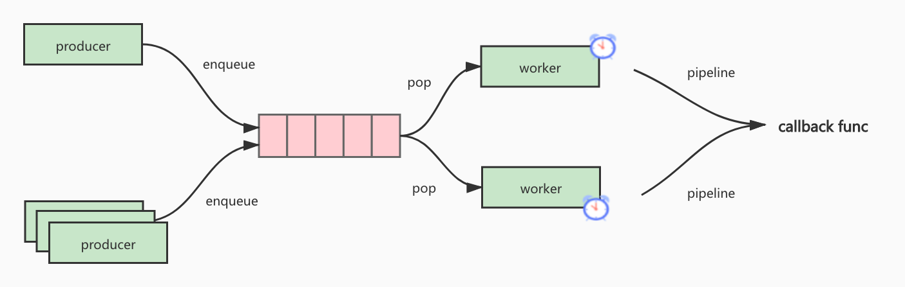

## go-pipeline

`merge request`

if task's count is grater than `batchSize`, then handle callback, otherwise wait `maxPeriod` duration. 
while sleep `maxPeriod` duration, if task's count is gaterh than `batchSize`, handle at once.



### Example

```go
package main

import (
	"errors"
	"fmt"
	"sync"
	"time"

	"github.com/rfyiamcool/go-pipeline"
)

var (
	errQueueFull = errors.New("the queue is full !!!")

	wg          sync.WaitGroup
	taskHandler *pipeline.MergeRequests
)

func init() {
	callback := func(srcs []interface{}) error {
			if len(srcs) > 10 {
				panic("the length must < 10")
			}

			fmt.Printf("handle data => %+v \n", srcs)

			for i := 0; i < len(srcs); i++ {
				wg.Done()
			}
			return nil
}
	taskHandler = pipeline.NewMergeRequests(
		"hello_world",
		callback,
		pipeline.SetBatchSize(50),
		pipeline.SetMinWorkerNum(1),
		pipeline.SetMaxWorkerNum(1),
		pipeline.SetPeriod(1*time.Second),
		pipeline.SetQueueSize(1000),
	)
}

func main() {
	taskHandler.Start()
	defer taskHandler.Stop()

	for i := 0; i < 100; i++ {
		wg.Add(1)
		taskHandler.EnqueueBlock(i)

		time.Sleep(100 * time.Millisecond)
	}

	wg.Wait()
}
```